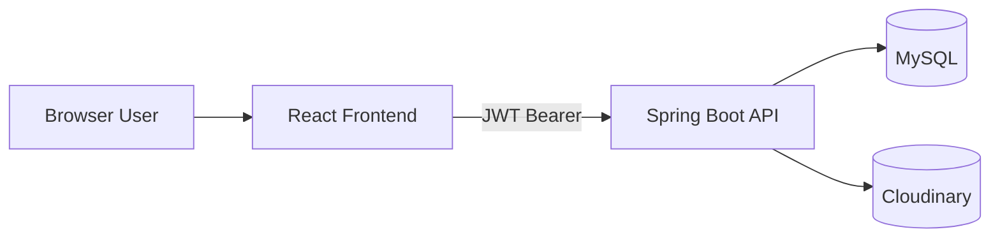
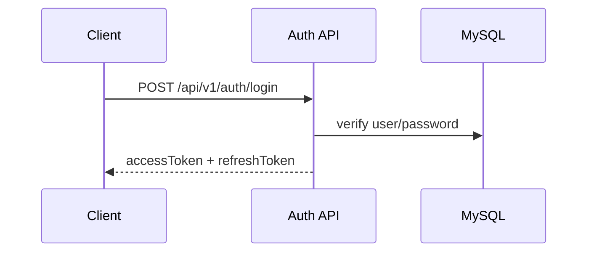
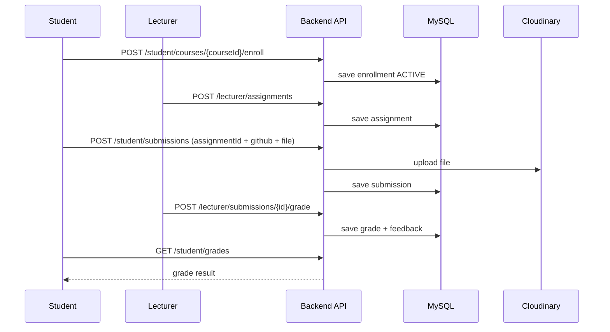

# IT211 Course Management System

Hệ thống quản lý khóa học và chấm đồ án theo mô hình phân quyền 3 vai trò: Admin, Lecturer, Student.

## 1. Tổng quan hệ thống

- Backend: Spring Boot 4.1 (REST API, stateless, JWT)
- Frontend: React + TypeScript + Vite
- Database: MySQL
- File storage: Cloudinary (nộp bài và tài liệu giảng dạy)
- API docs: Swagger OpenAPI
- Token blacklist: MySQL table `token_blacklist` (không dùng Redis runtime)

## 2. Kiến trúc tổng thể



## 3. Vai trò và phạm vi

- Admin:
  - Quản lý users (CRUD, search, paging, edit name/role/enabled)
  - Quản lý courses (CRUD, search, paging, edit course/lecturer)
- Lecturer:
  - Tạo assignment cho course phụ trách
  - Upload/list/update/delete lecture materials
  - Xem submissions, chấm điểm và feedback
- Student:
  - Enroll/cancel enrollment
  - Xem assignments của các lớp đã enroll
  - Nộp bài (GitHub URL + file)
  - Xem lịch sử nộp bài, điểm, tài liệu

## 4. Luồng xác thực và bảo mật

### 4.1 Login và cấp JWT



### 4.2 Refresh token

- Frontend tự động refresh khi access token hết hạn (HTTP 401).
- Backend kiểm tra token type, chữ ký, expiry, blacklist.

### 4.3 Logout và blacklist

- Khi logout, access token được ghi vào bảng `token_blacklist`.
- `JwtAuthenticationFilter` chặn request dùng token đã bị revoke.

## 5. Luồng nghiệp vụ chính

### 5.1 Admin flow

1. Admin tạo Lecturer và Student.
2. Admin tạo Course và gán Lecturer.
3. Admin có thể chỉnh sửa Name/Role/Enabled của user.
4. Admin có thể chỉnh sửa Code/Name/Description/Lecturer của course.

### 5.2 Lecturer flow

1. Lecturer tạo Assignment cho course mình phụ trách.
2. Lecturer upload tài liệu giảng dạy.
3. Lecturer xem danh sách submissions.
4. Lecturer nhập điểm và feedback.

### 5.3 Student flow

1. Student enroll course.
2. Student xem assignments theo các course đã enroll.
3. Student nộp bài theo assignment.
4. Student xem lịch sử submission, materials, grades.

### 5.4 Submission và grading flow



## 6. API map (rút gọn)

### 6.1 Auth

- `POST /api/v1/auth/register`
- `POST /api/v1/auth/login`
- `POST /api/v1/auth/refresh-token`
- `POST /api/v1/auth/logout`
- `POST /api/v1/auth/forgot-password`
- `POST /api/v1/auth/reset-password`

### 6.2 User profile

- `GET /api/v1/users/me`
- `PUT /api/v1/users/me`
- `POST /api/v1/users/me/change-password`

### 6.3 Admin

- Users: `GET/POST /api/v1/admin/users`, `GET/PUT/DELETE /api/v1/admin/users/{id}`
- Courses: `GET/POST /api/v1/admin/courses`, `GET/PUT/DELETE /api/v1/admin/courses/{id}`

### 6.4 Lecturer

- Assignments: `POST /api/v1/lecturer/assignments`, `GET /api/v1/lecturer/assignments`
- Submissions/grades: `GET /api/v1/lecturer/submissions`, `POST /api/v1/lecturer/submissions/{submissionId}/grade`, `GET /api/v1/lecturer/grades`
- Materials: `POST/GET/PUT/DELETE /api/v1/lecturer/materials...`

### 6.5 Student

- Enrollments: `GET /api/v1/student/courses`, `POST/DELETE /api/v1/student/courses/{courseId}/enroll`, `GET /api/v1/student/courses/enrollments`
- Assignments: `GET /api/v1/student/courses/assignments`
- Submissions: `POST/GET /api/v1/student/submissions`
- Learning: `GET /api/v1/student/materials`, `GET /api/v1/student/grades`

## 7. Cài đặt và chạy

### 7.1 Yêu cầu

- Java 21+
- MySQL 8+
- Node.js 18+, npm 9+

### 7.2 Tạo database

```sql
CREATE DATABASE IF NOT EXISTS course_management
  CHARACTER SET utf8mb4
  COLLATE utf8mb4_unicode_ci;
```

### 7.3 Cấu hình biến môi trường

Tạo file `Backend/backend/.env`:

```properties
JWT_SECRET=<base64-secret>
MYSQL_USERNAME=root
MYSQL_PASSWORD=<password>
CLOUDINARY_CLOUD_NAME=<cloud-name>
CLOUDINARY_API_KEY=<api-key>
CLOUDINARY_API_SECRET=<api-secret>
```

### 7.4 Chạy backend

Windows:

```bash
cd Backend/backend
gradlew.bat bootRun
```

macOS/Linux:

```bash
cd Backend/backend
./gradlew bootRun
```

Backend URL: `http://localhost:8080`
Swagger URL: `http://localhost:8080/swagger-ui.html`

### 7.5 Chạy frontend

```bash
cd Frontend
npm install
npm run dev
```

Frontend URL: `http://localhost:5173`

## 8. Kiểm thử nhanh end-to-end

1. Login Admin, tạo 1 Lecturer và 1 Student.
2. Tạo 1 Course và gán Lecturer.
3. Login Lecturer, tạo 1 Assignment cho course.
4. Login Student, enroll course và nộp bài theo assignment vừa tạo.
5. Login Lecturer, chấm điểm submission.
6. Login Student, kiểm tra grade hiển thị.

## 9. Unit test

```bash
cd Backend/backend
gradlew.bat test
```

Report: `Backend/backend/build/reports/tests/test/index.html`

## 10. Cấu trúc thư mục

```text
it211_project/
  Backend/backend/
    src/main/java/com/example/backend/
      controller/
      service/
      repository/
      entity/
      dto/
      security/
      exception/
      config/
      aop/
  Frontend/src/
    pages/
    api/
    routes/
    context/
    types/
```

## 11. Troubleshooting

### 11.1 MySQL connection refused

- Kiểm tra MySQL service đang chạy.
- Kiểm tra `MYSQL_USERNAME`, `MYSQL_PASSWORD` trong `.env`.
- Kiểm tra DB `course_management` đã tạo.

### 11.2 401 Unauthorized

- Access token hết hạn: frontend sẽ tự refresh.
- Nếu refresh token không hợp lệ hoặc bị revoke: đăng nhập lại.

### 11.3 Upload file lỗi

- Kiểm tra Cloudinary env vars.
- Kiểm tra định dạng file và kích thước file upload.

## 12. Ghi chú hiện trạng

- Token blacklist đang dùng MySQL.
- Chức năng assignment cho lecturer và list assignment cho student đã được triển khai.
- Admin UI đã có edit inline cho Users và Courses.
