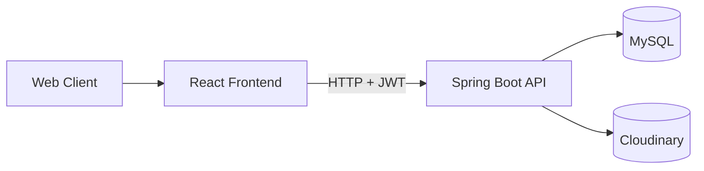

# IT211 Course Management System - README v3 (Technical Deep Dive)

## 1. System Architecture



## 2. Core Components
### 2.1 Backend modules
- `controller`: REST endpoints by role (auth/admin/lecturer/student/user)
- `service`: business logic (auth, enrollment, submission, grade, material, assignment)
- `repository`: JPA data access
- `entity`: domain model (User, Course, Enrollment, Assignment, Submission, Grade, Material, TokenBlacklist)
- `security`: JWT util + filter + Spring Security config
- `exception`: global exception handling and API error shape
- `aop`: logging aspect

### 2.2 Frontend modules
- `pages`: role-specific pages (admin/lecturer/student/auth)
- `api`: API clients by domain
- `context`: auth state and session lifecycle
- `routes`: role-protected navigation
- `types`: TypeScript contracts

## 3. Data Model Summary
- User (ADMIN, LECTURER, STUDENT)
- Course (belongs to lecturer)
- Enrollment (student <-> course, ACTIVE/CANCELLED)
- Assignment (belongs to course, created by lecturer)
- Submission (student submits per assignment)
- Grade (lecturer scores a submission)
- LectureMaterial (lecturer uploads materials per course)
- TokenBlacklist (revoked JWT tokens)

## 4. Security and Auth Flow
### 4.1 Login
1. Client sends email/password.
2. Backend authenticates and returns access + refresh token.
3. Frontend stores tokens and user role.

### 4.2 Request authorization
1. Frontend adds Bearer token.
2. JWT filter validates token signature, type, expiry.
3. Filter checks token blacklist in MySQL.

### 4.3 Refresh
1. Frontend interceptor sees 401.
2. Calls refresh endpoint with refresh token.
3. On success, retries original request with new access token.

### 4.4 Logout
1. Client posts logout.
2. Access token written to `token_blacklist`.
3. Further use of same token is denied.

## 5. Business Flows
### 5.1 Admin flow
- Manage users: create/search/paging/edit/delete.
- Manage courses: create/search/paging/edit/delete.

### 5.2 Lecturer flow
- Create/list assignments for owned courses.
- Upload/list/update/delete lecture materials.
- List student submissions.
- Grade submission with score + feedback.

### 5.3 Student flow
- Browse and enroll courses.
- View enrolled courses.
- View assignments from enrolled courses.
- Submit assignment (githubUrl + file).
- View submission history, grades, materials.

## 6. API Domain Map
### Auth
- `POST /api/v1/auth/register`
- `POST /api/v1/auth/login`
- `POST /api/v1/auth/refresh-token`
- `POST /api/v1/auth/logout`
- `POST /api/v1/auth/forgot-password`
- `POST /api/v1/auth/reset-password`

### Admin
- Users: `/api/v1/admin/users`
- Courses: `/api/v1/admin/courses`

### Lecturer
- Assignments: `/api/v1/lecturer/assignments`
- Submissions and grading: `/api/v1/lecturer/submissions`, `/api/v1/lecturer/grades`
- Materials: `/api/v1/lecturer/materials`

### Student
- Courses and enrollments: `/api/v1/student/courses`
- Assignments: `/api/v1/student/courses/assignments`
- Submissions: `/api/v1/student/submissions`
- Learning data: `/api/v1/student/grades`, `/api/v1/student/materials`

## 7. Build and Quality Gates
### Backend
```bash
cd Backend/backend
gradlew.bat classes
gradlew.bat test
```

### Frontend
```bash
cd Frontend
npm run build
```

## 8. Known Gaps
1. Refresh rotation and refresh revoke not yet fully strict.
2. Submission currently requires both githubUrl and file.
3. Frontend UI for forgot/reset/change password is pending.
4. FR-13 Redis variant is not active in this branch (using MySQL blacklist).

## 9. Suggested Next Iteration
- Add assignment due-date notifications.
- Add course/assignment filters in student dashboard.
- Add integration tests for role-based end-to-end flows.
- Add CI pipeline for backend tests + frontend build.
